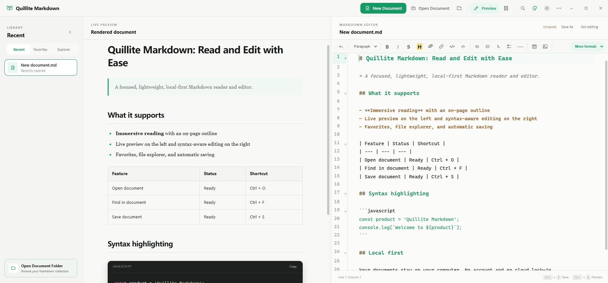
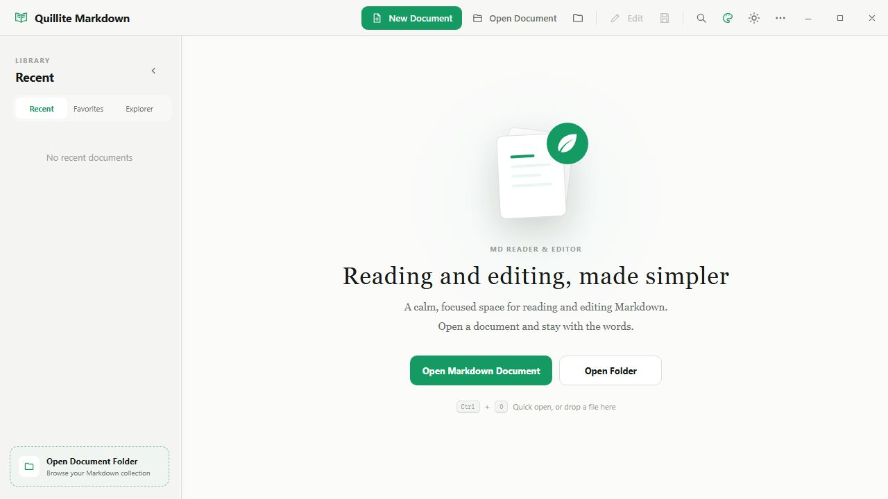
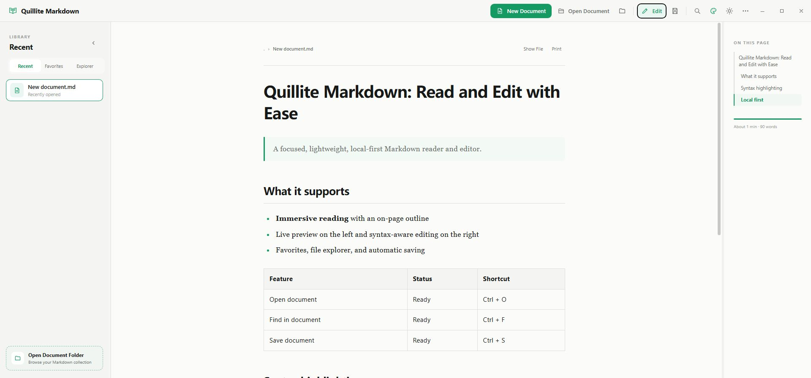
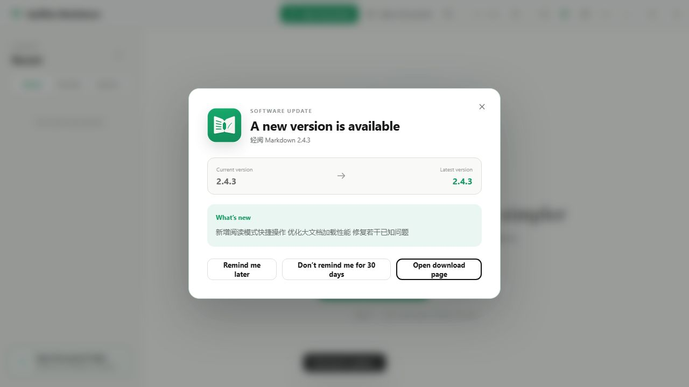

<div align="center">
  
  <h1>Quillite Markdown</h1>
  <p><strong>A fast, local-first Markdown reader, viewer and editor — about 7 MB on Windows.</strong></p>
  <p>Live preview · Syntax highlighting · Plain local files · Windows, macOS and Linux</p>
  <p><a href="README.md">简体中文</a> · <strong>English</strong></p>
  <p>
    <a href="https://github.com/liuhang798/quillite-markdown/actions/workflows/release.yml"></a>
    <a href="https://github.com/liuhang798/quillite-markdown/releases/latest"></a>
    <a href="LICENSE"></a>
    
  </p>
  <p>
    <a href="https://liuhang798.github.io/"><strong>Official website</strong></a>
    ·
    <a href="https://github.com/liuhang798/quillite-markdown/releases/latest"><strong>Download latest release</strong></a>
    · <a href="#screenshots">Screenshots</a>
    · <a href="#development">Build from source</a>
  </p>
</div>



## Why Quillite Markdown?

- **Lightweight by design:** the Windows installer is only about **7 MB**, built with Go and Wails instead of Electron.
- **Local-first and private:** open and edit ordinary Markdown files on your computer—no account, proprietary vault or cloud lock-in.
- **Reading and editing together:** switch from a focused Markdown reader to split-view editing with live preview and syntax highlighting.
- **Practical desktop integration:** recent files, document favorites, resource explorer, autosave, native dialogs, file associations and update notifications.
- **Cross-platform and open source:** one MIT-licensed Markdown desktop app for Windows, macOS and Linux.

It is a good fit for reading long Markdown documents, editing README files, maintaining technical notes and working with local documentation folders.

## Download

| Platform | Package | Download |
|---|---|---|
| Windows x64 | Step-by-step installer (`.exe`) | [Latest release](https://github.com/liuhang798/quillite-markdown/releases/latest) |
| macOS | Universal Intel + Apple Silicon (`.dmg`) | [Latest release](https://github.com/liuhang798/quillite-markdown/releases/latest) |
| Linux x64 | Debian package + portable AppImage | [Latest release](https://github.com/liuhang798/quillite-markdown/releases/latest) |

On Windows, run `quillite-markdown-version-windows-amd64.exe` and follow the setup wizard. The installer can create a desktop shortcut, register Markdown file associations, automatically reuse the previous installation directory during an upgrade, and launch the app after setup. The Windows install, upgrade, and uninstall flow is presented entirely in Simplified Chinese. A fresh installation starts the app in Chinese, while the app interface can still be switched to English afterward.

The macOS build follows the computer's light/dark appearance automatically while still allowing a temporary manual switch. The temporary choice stays active until the system next changes between light and dark, then automatic following resumes. The interface and native title bar update together whenever the system mode changes. It centers native left-side window controls vertically within a slim title bar, and the controls stay stable during tiling and resizing. In fullscreen, the Logo and application name move left automatically, then restore the traffic-light safe area immediately on exit without briefly overlapping. Standard Command shortcuts remain available: `Command + W` closes the window while keeping the app in the background, and `Command + Q` quits the app. Closing from fullscreen exits fullscreen before hiding in the background; lazy editor loading and deferred explorer restoration reduce cold-start work.

## What's new in 2.4.3

- Unified the default brand green at the exact `#159A63`; primary controls are no longer automatically darkened to `#10744A`, keeping buttons, selections, accent text, and application icons on the same green.
- Replaced the top-left brand tile with a transparent open-book mark whose strokes follow the selected accent, with no square plate, border, or shadow.
- Aligned the title-bar book mark and “Quillite Markdown” label to the same visual height, with dedicated sizing for the compact macOS title bar.
- Removed drop shadows from accent-colored buttons (New Document, back-to-top, home leaf icon) for a cleaner look; selected states keep their theme-colored outline.
- The Windows install, upgrade, and uninstall wizard is now Simplified Chinese only, with no setup-language dialog; compatibility messages, WebView2 progress text, and file-open actions are localized as well.
- Text zoom now applies globally: the reading content, the recent/explorer sidebar, and the table of contents all scale together.
- The sidebar and table-of-contents dividers no longer have a maximum width; they can be dragged freely and the width is remembered.

## What's new in 2.4.2

- The editor split panes (live preview / editor) now have a draggable divider with no maximum width limit; the width is remembered and restored on the next launch.
- Added a "format painter" to the editor: select text with formatting (bold, italic, strikethrough, highlight, inline code, heading, quote, or list), click the painter button to copy the format, then select the target text to apply it automatically. Press Esc to cancel.

## What's new in 2.4.1

- The live preview now follows the cursor while editing: wherever the caret moves, the preview scrolls to the matching section or paragraph.
- An “Exit editing” button in the editor header returns you to the immersive reading view in one click.
- Inserting a code block lets you pick from 19 common programming languages (JavaScript, Python, Go, Java, C/C++, Rust, HTML, SQL, and more); the language-tagged fence is written and highlighted automatically.

## What's new in 2.4.0

- Fixed the Windows in-app updater's executable-locking issue by running its helper from a separate temporary executable instead of the installed application file.
- After download and verification, the app can close the old version, replace it, and reopen automatically without another installer wizard.
- Update failures now include an explicit reason in `轻阅 Markdown/update/apply-update.log` under the user's configuration directory.
- Older clients cannot repair their own updater, so 2.3.12 or later must be installed manually once; future releases can then use installer-free in-app updates.

## What's new in 2.3.5

- Plain-text `.txt` files are fully supported: the reader and the live editor preview render them as-is (no Markdown parsing), the editor uses plain text mode, and files open from the dialog, drag-in, or folder explorer. The installer registers the `.txt` association for double-click opening.
- Insert images either from local files or by pasting an `http/https` online link with an optional description.
- Added in-app automatic updates: the update dialog can download and apply the new version directly with a progress bar and integrity check, then restart automatically — no manual download, installer wizard, or macOS Gatekeeper approval needed. Supported on macOS and Windows; Linux keeps the manual download flow.

## What's new in 2.3.4

- Returning to Quillite Markdown now reloads the active document after another application changes it, while local unsaved edits remain protected from replacement.
- The More menu now offers document width presets — narrow, medium, wide, and full width — applied to both the reader and the live editor preview and remembered across sessions.
- Fixed reader search skipping Markdown inline code and fenced code blocks; code text is now counted, highlighted, and navigated correctly.

## What's new in 2.3.3

- Preview text can be zoomed with `Ctrl + wheel` on Windows/Linux or `Command + wheel` on macOS, and the selected size is remembered in both reader and live-preview modes.
- Fixed Windows upgrades being interrupted when Explorer locked an old shortcut or Markdown association icon; the installer can now offer to close a running older version and continue.
- Added a persistent Favorites view. Right-click documents in Recent or Explorer to add or remove them from Favorites.
- Favorited documents display a filled accent-colored star in Recent, Favorites, and Explorer for quick recognition.
- Favorites survive restarts and remain independent from Recent; removing a favorite never deletes the original document.
- Moved, deleted, or temporarily unavailable favorites remain visible as unavailable records so they can still be cleaned up.

## Highlights

- Read and edit Markdown with the same calm, polished interface.
- Open, read, and edit plain-text `.txt` files too: the reader renders them as-is (no Markdown parsing), the editor uses plain text mode, and the `.txt` file association can be registered for double-click opening.
- Insert images either from local files or by pasting an `http/https` online link with an optional description.
- Split editing mode: live preview on the left, syntax-highlighted editor on the right.
- The formatting toolbar covers H1–H6, bold, italic, strikethrough, highlight, links, inline/fenced code, quotes, lists, tasks, horizontal rules, tables and images. When space runs out, controls move into More Formats instead of creating a horizontal scrollbar. More Formats also adds bold italic, underline, superscript, subscript, hard breaks, footnotes, reference links, autolinks, syntax escaping, HTML/collapsible blocks, keyboard keys and comments. Common actions support `Ctrl/Cmd + B`, `Ctrl/Cmd + I`, `Ctrl/Cmd + K`, `Ctrl/Cmd + Shift + X` and `Ctrl/Cmd + Shift + H`.
- Inserting a code block lets you pick a common programming language (JavaScript, Python, Go, Java, C/C++, Rust, HTML, SQL, and more) and writes a language-tagged fenced block with highlighting. An “Exit editing” button in the editor header returns you to the immersive reading view at any time.
- Undo from the toolbar or with `Ctrl/Cmd + Z`; each document has isolated history that stops at the originally loaded content.
- `Ctrl/Cmd + F` searches Markdown source in place, highlights matches and scrolls to the selected result; the polished find-and-replace panel follows the selected Chinese or English interface language.
- Create a Markdown file and begin editing immediately, with autosave every 10 seconds while editing.
- Clickable table of contents, active section tracking, search, print and back-to-top.
- Recent documents update immediately and individual records can be removed. Right-click a record for Edit, Show in Folder and Remove; Edit opens the Markdown document directly in editing mode, while reopening an existing item keeps its list position. Deleted, moved or temporarily unavailable source files are shown muted with a strikethrough and cannot be opened, but can still be removed from the menu.
- Favorite documents from Recent or Explorer and manage them in a dedicated persistent Favorites view with Open, Edit, Show in Folder, and Remove from Favorites actions.
- On macOS, closing the main window leaves the app running in the background. Clicking the Dock icon again restores and foregrounds the window, and Markdown files opened from Finder display directly.
- Simplified Chinese and English interface with persistent language selection.
- Accent color and light/dark mode are independent: choose Fresh Green, Clear Blue, Vivid Orange, Vivid Violet, Coral Red, Lake Cyan, Mist Slate or Clay Brown, then pair it with either color mode. Both choices are restored across launches.
- Synchronized reading/editor text zoom up to 200%, remembered across launches.
- Switch the left sidebar among Recent, Favorites, and a refreshable resource explorer for Markdown folders.
- Drag the library and document-outline dividers to customize panel widths; the layout is remembered locally.
- The resource explorer remembers its selected folder and active view across launches; click the active Explorer tab again to choose another folder.
- Native file open/save dialogs and `.md`, `.markdown`, `.mdown`, `.mkd` associations.
- Single-instance file opening and unsaved-change protection.
- A new split reading/editing brand icon with transparent rounded corners and no white square canvas. In-app Logos follow the selected accent while native system icons stay green; the About screen includes the author email and a direct repository link.
- Automatic checks for the latest stable GitHub Release, with release notes, one-click access to downloads, manual checks, and a 30-day reminder pause.

## Markdown format support

| Category | Editable and previewable formats |
|---|---|
| Text | Bold, italic, bold italic, strikethrough, highlight, underline, superscript, subscript, inline code, keyboard keys and Markdown escaping |
| Structure | H1–H6, paragraphs, quotes, horizontal rules, hard breaks, fenced code, HTML/collapsible blocks and HTML comments |
| Lists and data | Bulleted lists, numbered lists, task lists and tables |
| References | Inline links, reference links, autolinks, images and footnotes |

Preview is based on CommonMark/GFM. Highlight uses `==text==`; footnotes use `[^1]` and `[^1]: Content`. Underline, superscript, subscript, collapsible sections and keyboard keys use portable safe HTML tags that are sanitized by DOMPurify before display.

## Screenshots

| Home | Reader |
|---|---|
|  |  |




## Go + Wails v2

Version 2.0 and later replace Electron with Go and Wails while retaining the existing HTML/CSS interface and CodeMirror editor. The current Windows installer is about **7 MB**, compared with about 90 MB for the previous Electron build.

- Backend: Go 1.23+
- Desktop framework: Wails 2.13
- Frontend: HTML, CSS, JavaScript and Vite
- Markdown: marked, DOMPurify and highlight.js
- Editor: CodeMirror 6
- Windows installer: NSIS

## Project structure

- `main.go`: Wails startup and window configuration.
- `app.go`: documents, folders, recent files, preferences, and desktop integration.
- `updates.go`: GitHub Releases checks and version comparison.
- `frontend/`: Markdown reader, CodeMirror editor, and bilingual interface.
- `build/`: application icons and platform build configuration.
- `packaging/`: Linux desktop integration and package metadata.
- `scripts/`: repeatable project asset-maintenance scripts.

New Markdown documents do not require a location prompt. On macOS they are always stored in the user's `Documents/Quillite Markdown` folder so application upgrades cannot overwrite them. Portable Windows and Linux builds retain the application-directory preference with a Documents fallback. Saving a new document under another name removes its auto-created draft and duplicate Recent entry. Local images referenced by absolute or relative paths are loaded securely through the Go backend for reliable previewing.

## Downloads

Tagged releases are built automatically for:

- Windows x64: step-by-step NSIS installer
- macOS Universal: Intel and Apple Silicon DMG
- Linux x64: DEB and AppImage

Unsigned development builds may trigger Windows SmartScreen or macOS Gatekeeper warnings on first install. Production signing certificates are not included in this repository. In-app updates are unaffected: the new version is downloaded and applied by the app itself, so no repeated authorization is required.

## Development

Requirements: Go 1.23+, Node.js 22+, Wails 2.13 and the platform dependencies listed by Wails.

```bash
go install github.com/wailsapp/wails/v2/cmd/wails@v2.13.0
wails dev
```

Run tests:

```bash
go test ./...
cd frontend
npm install
npm run build
```

Build on the current platform:

```bash
wails build -clean -trimpath
```

On macOS, use the wrapper to produce a consistently named `轻阅 Markdown.app` bundle:

```bash
bash scripts/build-macos.sh darwin/universal
```

Build the Windows installer:

```bash
wails build -clean -platform windows/amd64 -nsis -installscope user -webview2 embed -trimpath
```

Push a tag such as `v2.3.5` to run the Windows, macOS and Linux workflow in `.github/workflows/release.yml` and publish all packages to GitHub Releases. The app checks the repository's latest stable Release when notifying users about updates. On macOS and Windows the update dialog can also download and apply the new version in-app with a progress bar, then restart automatically.

## Project documentation

- [Official website](https://liuhang798.github.io/)
- [Official website source](https://github.com/liuhang798/liuhang798.github.io)
- [Changelog](CHANGELOG.md)
- [AI project technical guide](AGENTS.md)
- [Contributing](CONTRIBUTING.md)
- [Security policy](SECURITY.md)
- [Release guide](RELEASING.md)
- [Design QA](design-qa.md)

## License

[MIT](LICENSE)
