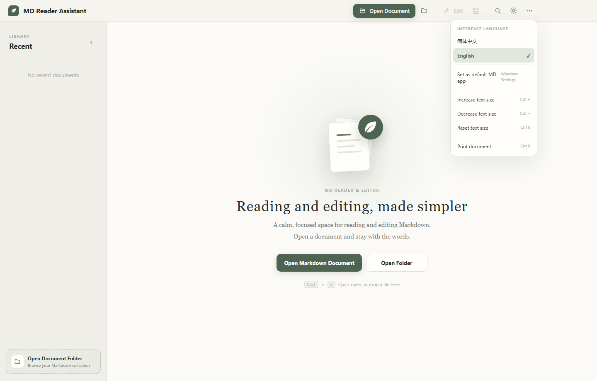

<div align="center">
  
  <h1>MD Reader Assistant</h1>
  <p>A beautiful local Markdown reader with live preview and syntax-highlighted editing for Windows.</p>
  <p><strong>English</strong> · <a href="README.zh-CN.md">简体中文</a></p>
</div>

---

## Screenshots

### Welcome


### Markdown Reader


### Live Preview and Syntax-Highlighted Editor


### English and Simplified Chinese Interface



## Features

- Open `.md`, `.markdown`, `.mdown`, `.mkd`, and `.txt` documents
- Browse Markdown files from an entire folder
- Update recent documents immediately and remove history entries without deleting files
- GitHub-flavored Markdown, tables, task lists, blockquotes, and code highlighting
- Clickable document outline with scroll tracking and active-section highlighting
- CodeMirror editor with line numbers, folding, syntax highlighting, wrapping, and search
- Live preview on the left and source editing on the right
- Switch between English and Simplified Chinese instantly; the selection is remembered
- Save, Save As, and unsaved-change protection
- Light and dark themes, adjustable reading size, in-document search, and printing
- Reading progress, estimated reading time, and a back-to-top button
- Guided Windows installer, desktop shortcut, and Markdown file associations

## Technology Stack

- JavaScript for application logic and Electron processes
- HTML and CSS for the Windows desktop UI and reading layout
- Electron and Node.js for the desktop runtime and local file access
- CodeMirror for syntax-highlighted Markdown editing
- Marked, DOMPurify, and highlight.js for rendering, sanitization, and code highlighting
- electron-builder and NSIS for the guided Windows installer and file associations

## Requirements

- 64-bit Windows 10 or Windows 11
- Node.js 20 or later for source development

## Development

```powershell
npm install
npm run dev
```

## Build the Windows Installer

```powershell
npm run build
```

Build artifacts are written to the `release` directory, for example:

```text
MD阅读助手-安装程序-1.4.0-x64.exe
```

## Interface Language

Open the **More options (⋯)** menu in the top-right corner, then choose **English** or **简体中文** under **Interface language**. The interface and native file dialogs update immediately, and the selection is restored the next time the app starts.

## Keyboard Shortcuts

| Shortcut | Action |
| --- | --- |
| `Ctrl + O` | Open document |
| `Ctrl + Shift + O` | Open folder |
| `Ctrl + E` | Toggle reader/editor mode |
| `Ctrl + S` | Save |
| `Ctrl + Shift + S` | Save As |
| `Ctrl + F` | Search |
| `Ctrl + P` | Print |
| `Ctrl + 0` | Reset text size |

## Project Structure

```text
MD Reader Assistant/
├─ src/                 Electron main process, preload, and UI source
├─ scripts/             Application icon generator
├─ build/               Application icon assets
├─ screenshots/         Project screenshots
├─ package.json         Project and packaging configuration
├─ package-lock.json    Dependency lockfile
├─ LICENSE              MIT license
├─ README.md            English documentation
└─ README.zh-CN.md      Simplified Chinese documentation
```

## Privacy

Documents are read, edited, searched, and rendered locally. The application does not upload document content.

## Contributing

Issues and pull requests are welcome. Before submitting code, make sure `npm run build:renderer` completes successfully and describe the purpose of the change and how it was verified.

## License

This project is released under the [MIT License](LICENSE).
