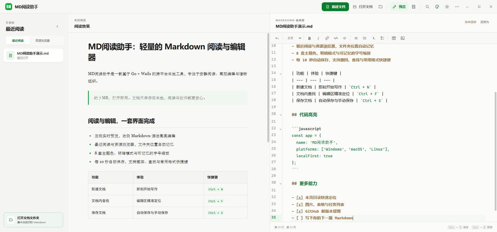
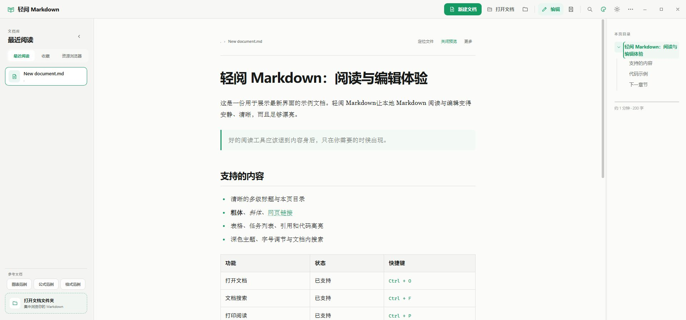

<div align="center">
  
  <h1>轻阅 Markdown</h1>
  <p><strong>快速、本地优先的 Markdown 阅读器、查看器和编辑器——Windows 安装包仅约 7 MB。</strong></p>
  <p>实时预览 · 语法高亮 · 本地文件 · Windows、macOS、Linux</p>
  <p><strong>简体中文</strong> · <a href="README.en.md">English</a></p>
  <p>
    <a href="https://github.com/liuhang798/quillite-markdown/actions/workflows/release.yml"></a>
    <a href="https://github.com/liuhang798/quillite-markdown/releases/latest"></a>
    <a href="LICENSE"></a>
    
  </p>
  <p>
    <a href="https://liuhang798.github.io/"><strong>访问官网</strong></a>
    ·
    <a href="https://github.com/liuhang798/quillite-markdown/releases/latest"><strong>下载最新版本</strong></a>
    · <a href="#项目截图">查看截图</a>
    · <a href="#本地开发">从源码构建</a>
  </p>
</div>



## 为什么选择轻阅 Markdown？

- **真正轻量：**使用 Go + Wails 构建，不依赖 Electron，Windows 安装包仅约 **7 MB**。
- **本地优先：**直接读取和保存电脑中的普通 Markdown 文件，无需账号、专用仓库或云端绑定。
- **阅读编辑一体：**既有专注的 Markdown 阅读模式，也有左侧实时预览、右侧语法高亮的分栏编辑模式。
- **完整桌面体验：**最近阅读、文档收藏、资源浏览器、自动保存、原生文件窗口、文件关联和更新提醒一应俱全。
- **跨平台开源：**采用 MIT 许可证，同时支持 Windows、macOS 和 Linux。

适合阅读长篇 Markdown 文档、编辑 README、维护技术笔记，以及集中管理本地文档文件夹。

## 下载

| 平台 | 安装包 | 下载 |
|---|---|---|
| Windows x64 | 分步安装程序（`.exe`） | [下载最新版本](https://github.com/liuhang798/quillite-markdown/releases/latest) |
| macOS | Intel + Apple Silicon 通用版（`.dmg`） | [下载最新版本](https://github.com/liuhang798/quillite-markdown/releases/latest) |
| Linux x64 | Debian 安装包 + 便携 AppImage | [下载最新版本](https://github.com/liuhang798/quillite-markdown/releases/latest) |

Windows 用户运行 `quillite-markdown-版本-windows-amd64.exe`，按安装向导操作即可；安装程序支持创建桌面快捷方式、Markdown 文件关联、升级时沿用上次安装目录，并在安装完成后直接启动软件。Windows 的安装、升级与卸载流程统一使用简体中文；全新安装默认以简体中文启动软件，进入软件后仍可切换 English 界面。

macOS 版本会自动跟随电脑的白天/黑夜外观，也允许用户临时手动切换；临时选择会保持到系统下一次切换白天或黑夜模式，随后自动恢复跟随。系统模式变化时界面与原生标题栏同步切换；使用在轻薄标题栏中垂直居中的系统原生窗口控制按钮与应用菜单，半屏平铺和窗口缩放时按钮位置保持稳定。进入全屏后 Logo 和软件名称会自动向左对齐，退出后立即恢复窗口按钮安全间距且不会短暂重叠。支持标准 Command 快捷键：`Command + W` 关闭窗口并留在后台，`Command + Q` 真正退出应用。全屏关闭时会先退出全屏再隐藏到后台；编辑器和资源浏览器采用延迟初始化，减少冷启动等待。

## 2.4.3 更新亮点

- 默认品牌绿统一为精确的 `#159A63`；主按钮不再自动加深为 `#10744A`，按钮、选中态、强调文字及应用图标保持同一绿色。
- 左上角品牌标识改为透明背景的打开书本图形，书本线条跟随当前主题色，不再使用方形底板、边框或阴影。
- 标题栏书本图标与“轻阅 Markdown”文字采用一致的视觉高度并上下居中对齐，Windows 与 macOS 紧凑标题栏分别适配。
- 取消新建文档、回到顶部、首页叶子图标等主题色按钮的投影阴影，界面更干净利落；选中状态仍保留主题色描边标识。
- Windows 安装、升级与卸载向导统一为简体中文，不再显示安装语言选择窗口；系统兼容提示、WebView2 安装提示和文件打开方式等细节同步中文化。
- 文字放大缩小作用于全局：阅读正文、左侧最近阅读/资源浏览器、右侧本页目录同步缩放。
- 左侧文档库与右侧目录分隔条不再限制最大宽度，可自由调整并自动记忆。

## 2.4.2 更新亮点

- 编辑分栏（左侧实时预览 / 右侧编辑器）新增可拖动分隔条，无最大宽度限制，自由调整两侧宽度并自动记忆。
- 编辑模式新增“格式刷”：选中一段带格式的文本（加粗、斜体、删除线、高亮、行内代码、标题、引用或列表），点击工具栏格式刷复制格式，再选中目标文本即自动应用，按 `Esc` 取消。

## 2.4.1 更新亮点

- 编辑时左侧实时预览跟随光标滚动：光标移到哪一行，预览就定位到对应的章节或段落，边写边看排版效果。
- 编辑器头部新增“退出编辑”按钮，一键离开编辑状态回到沉浸式阅读页。
- 插入代码块时可选择常用编程语言（JavaScript、Python、Go、Java、C/C++、Rust、HTML、SQL 等 19 种），自动写入带语言标识的围栏代码块并高亮。

## 2.4.0 更新亮点

- 修复 Windows 应用内更新的文件占用问题：更新 helper 从独立临时 exe 运行，不再锁住待替换的主程序。
- 新版本下载并校验后可自动关闭旧版、覆盖程序并重新打开，无需再次运行安装向导。
- 更新失败时会在用户配置目录的 `轻阅 Markdown/update/apply-update.log` 中记录明确原因。
- 旧客户端的 updater 无法自行修复，因此需要手动安装 2.3.12 或更高版本一次；之后即可使用应用内无安装更新。

## 2.3.5 更新亮点

- 兼容纯文本 TXT 文件：阅读页与编辑实时预览按纯文本渲染（保留原格式，不解析 Markdown 语法），编辑模式使用纯文本语法；支持从打开对话框、拖放或文件夹浏览直接打开，安装时注册 `.txt` 文件关联，双击即可打开。
- 插入图片支持两种方式：选择本地图片，或粘贴 `http/https` 在线图片链接（可附图片说明）。
- 新增应用内自动更新：检测到新版本后可直接“下载并更新”，应用内下载（带进度条）、校验完整性后自动替换并重启，无需手动下载安装或再到系统设置授权；macOS 与 Windows 均支持，Linux 保持手动下载。

## 2.3.4 更新亮点

- 当前文档被其他软件修改后，切回轻阅 Markdown 会自动重新读取并刷新预览；本软件存在未保存编辑时不会覆盖当前内容。
- “更多”菜单新增文档宽度调整：窄 / 中 / 宽 / 全宽四档，阅读页与编辑实时预览同步生效并自动记忆。
- 修复阅读页查找无法匹配 Markdown 行内代码和代码块内容的问题，代码文字现在会正常计数、高亮并定位。

## 2.3.3 更新亮点

- 文档预览支持鼠标滚轮缩放：Windows/Linux 使用 `Ctrl + 滚轮`，macOS 使用 `Command + 滚轮`，阅读页与编辑模式实时预览均可使用并自动记忆字号。
- 修复 Windows 覆盖安装时快捷方式或 Markdown 文件关联图标被资源管理器占用而中断的问题；若旧版仍在运行，安装器会提供关闭旧版并继续的选项。
- 新增持久化“收藏”视图；可在最近阅读或资源浏览器中右键收藏文档，收藏列表重启后仍保留。
- 最近阅读、收藏和资源浏览器中的已收藏文档会显示主题色实心五角星，浏览列表时可快速区分。
- 右键菜单会根据当前状态显示“收藏文档”或“取消收藏”；取消收藏只移除记录，绝不会删除原文件。
- 已移动、删除或磁盘暂时不可用的收藏仍会显示为不可用记录，方便用户稍后清理。

## 主要功能

- 美观舒适的 Markdown 阅读与编辑界面。
- 支持打开、阅读和编辑纯文本 `.txt` 文件：阅读页按纯文本渲染（保留原格式，不解析 Markdown 语法），编辑模式使用纯文本语法，并可注册 `.txt` 文件关联双击打开。
- 插入图片支持两种方式：选择本地图片，或粘贴 `http/https` 在线图片链接（可附图片说明）。
- 左侧实时预览、右侧 Markdown 语法高亮编辑。
- 编辑工具栏覆盖 H1–H6、加粗、斜体、删除线、高亮、链接、行内/块级代码、引用、列表、任务、分隔线、表格和图片；空间不足时自动把按钮收进“更多格式”，不再出现横向滚动条。“更多格式”还可插入粗斜体、下划线、上下标、强制换行、脚注、引用式链接、自动链接、转义符号、HTML/折叠区块、键盘按键和注释。常用格式支持 `Ctrl/Cmd + B`、`Ctrl/Cmd + I`、`Ctrl/Cmd + K`、`Ctrl/Cmd + Shift + X`、`Ctrl/Cmd + Shift + H`。
- 插入代码块时可选择常用编程语言（JavaScript、Python、Go、Java、C/C++、Rust、HTML、SQL 等），自动写入带语言标识的围栏代码块并高亮；编辑器头部提供“退出编辑”按钮，随时回到沉浸式阅读页。
- 支持工具栏或 `Ctrl/Cmd + Z` 连续撤回；不同文档的撤回历史相互隔离，无法撤销掉刚打开时的原始内容。
- 编辑状态下使用 `Ctrl/Cmd + F` 会直接查找 Markdown 源码，高亮匹配项并滚动定位；查找替换面板支持中英文界面并与整体视觉风格保持一致。
- 支持新建 Markdown 文件并立即编辑，编辑期间每 10 秒自动保存。
- 点击目录定位章节、当前章节跟随、文档搜索、打印和回到顶部。
- 左侧文档库和右侧本页目录支持拖动分隔条调整宽度，并在下次启动时恢复上次布局。
- 资源浏览器自动记忆已选文件夹和当前视图，下次启动继续显示；再次点击已激活的“资源浏览器”可更换文件夹。
- 收藏文档独立于最近阅读；可从最近阅读和资源浏览器右键收藏，并在“收藏”视图中打开、编辑、定位或取消收藏。
- 打开文档后立即进入最近阅读，并可单独移除阅读记录；右键记录会弹出“编辑 / 打开所在文件夹 / 移除”菜单，其中“编辑”会直接打开 Markdown 文档并进入编辑模式，再次点击已有记录不会改变列表顺序。原文件已删除、移动或暂时无法访问时，记录会显示为灰色删除线且不可打开，但仍可从菜单移除。
- macOS 关闭主窗口后应用继续在后台运行；再次点击 Dock 图标会恢复窗口并置于最前方，从 Finder 打开关联的 Markdown 文件会直接显示文档。
- 简体中文和 English 界面切换，并自动记忆语言选择。
- 主题颜色与白天/黑夜模式相互独立：可从清新绿、晴空蓝、活力橙、灵动紫、珊瑚红、湖水蓝、雾蓝灰和陶土棕中选择任意强调色，再自由搭配明暗模式；两项设置都会自动记忆。
- 阅读/编辑字号同步调节，最高支持 200%，并在下次启动时恢复上次比例。
- 左侧可在“最近阅读”“收藏”和“资源浏览器”间切换，支持打开文件夹、刷新文件列表并集中浏览 Markdown。
- 原生打开/保存窗口，关联 `.md`、`.markdown`、`.mdown`、`.mkd` 文件。
- 单实例打开文件和未保存修改保护。
- 全新分栏阅读/编辑品牌图标，采用透明圆角边缘、无白色方底；应用内 Logo 会跟随主题颜色，系统图标保持默认绿色。“关于”页面包含作者邮箱和可直达的开源仓库。
- 启动时自动检查 GitHub Releases；发现新版本后可查看更新说明，选择“下载并更新”在应用内直接完成升级（带进度条，自动重启），或打开下载页面手动安装，也可 30 天内不再自动提醒；设置菜单仍支持手动检查。
- macOS 与 Windows 支持应用内自动更新：新版本由应用自行下载并替换，不会反复触发系统授权提示；macOS 首次安装的 Gatekeeper 提示仍可能因未签名出现。

## Markdown 格式支持

| 分类 | 可编辑并预览的格式 |
|---|---|
| 文本 | 加粗、斜体、粗斜体、删除线、高亮、下划线、上标、下标、行内代码、键盘按键、Markdown 转义 |
| 结构 | H1–H6、段落、引用、分隔线、强制换行、代码块、HTML/折叠区块、HTML 注释 |
| 列表与数据 | 无序列表、有序列表、任务列表、表格 |
| 引用资源 | 普通链接、引用式链接、自动链接、图片、脚注 |

预览以 CommonMark/GFM 为基础；高亮使用 `==文字==`，脚注使用 `[^1]` 与 `[^1]: 内容`。下划线、上下标、折叠区块和键盘按键采用可移植的安全 HTML 标签，并在预览时经过 DOMPurify 清理。

## 项目截图

| 首页 | 阅读界面 |
|---|---|
|  |  |


## Go + Wails 2.0

2.0 版本开始使用 Go 和 Wails 替换 Electron，同时保留现有 HTML/CSS 界面和 CodeMirror 编辑器。当前 Windows 安装包约为 **7 MB**，原 Electron 安装包约为 90 MB。

- 后端：Go 1.23+
- 桌面框架：Wails 2.13
- 前端：HTML、CSS、JavaScript、Vite
- Markdown：marked、DOMPurify、highlight.js
- 编辑器：CodeMirror 6
- Windows 安装：NSIS

## 项目结构

- `main.go`：Wails 应用启动与窗口配置。
- `app.go`：文档、文件夹、最近阅读、偏好设置及桌面系统能力。
- `updates.go`：GitHub Releases 更新检查与版本比较。
- `frontend/`：Markdown 阅读器、CodeMirror 编辑器和双语界面。
- `build/`：应用图标及各平台构建配置。
- `packaging/`：Linux 桌面集成与软件包元数据。
- `scripts/`：可重复执行的项目资源维护脚本。

新建 Markdown 文档时无需选择保存目录。macOS 会固定保存到用户的 `文稿/Quillite Markdown`，避免应用升级覆盖文档；Windows 与 Linux 便携版继续优先使用应用目录，不可写时自动回退到用户文档目录。新建文档另存后会自动删除临时草稿及重复的最近阅读记录。绝对路径和相对路径引用的本地图片均由 Go 后端安全读取，可在预览区正常显示。

## 多平台版本

发布版本标签后，GitHub Actions 会自动生成：

- Windows x64：分步安装的 NSIS 安装程序
- macOS Universal：同时支持 Intel 和 Apple Silicon 的 DMG
- Linux x64：DEB 和 AppImage

当前开发版本尚未配置付费代码签名证书，因此 Windows 首次安装可能出现 SmartScreen 提醒，macOS 首次安装可能出现 Gatekeeper 提醒；应用内自动更新不受影响，无需再次授权。

## 本地开发

需要安装 Go 1.23+、Node.js 22+、Wails 2.13，以及 Wails 对应平台的系统依赖。

```bash
go install github.com/wailsapp/wails/v2/cmd/wails@v2.13.0
wails dev
```

运行测试：

```bash
go test ./...
cd frontend
npm install
npm run build
```

在 macOS 上构建时使用统一脚本，生成的应用包会固定命名为 `轻阅 Markdown.app`：

```bash
bash scripts/build-macos.sh darwin/universal
```

生成 Windows 安装包：

```bash
wails build -clean -platform windows/amd64 -nsis -installscope user -webview2 embed -trimpath
```

推送 `v2.3.5` 等版本标签后，`.github/workflows/release.yml` 会自动构建三个系统的安装包并发布到 GitHub Releases。客户端会根据仓库的最新稳定 Release 提醒更新。

## 项目文档

- [项目官网](https://liuhang798.github.io/)
- [官网源代码](https://github.com/liuhang798/liuhang798.github.io)
- [更新记录](CHANGELOG.md)
- [AI 项目技术指南](AGENTS.md)
- [贡献指南](CONTRIBUTING.md)
- [安全策略](SECURITY.md)
- [发布指南](RELEASING.md)
- [设计验收记录](design-qa.md)

## 开源协议

[MIT](LICENSE)
