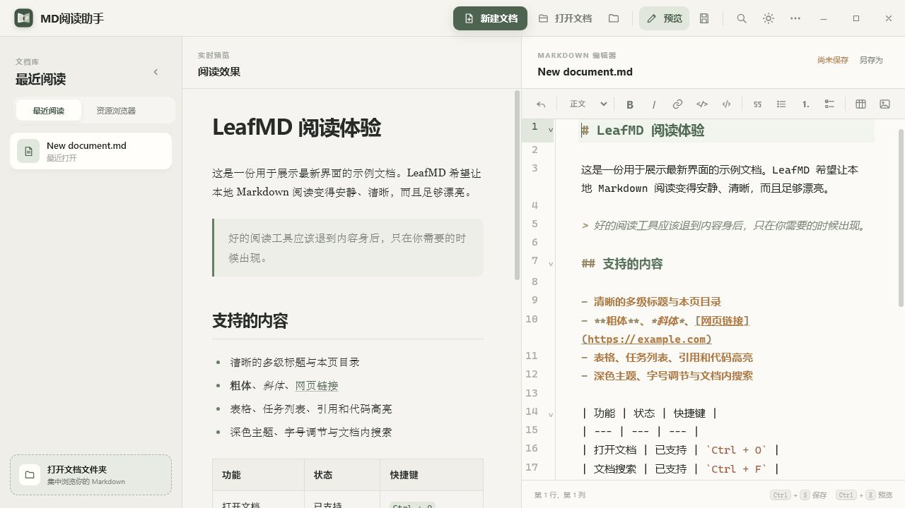
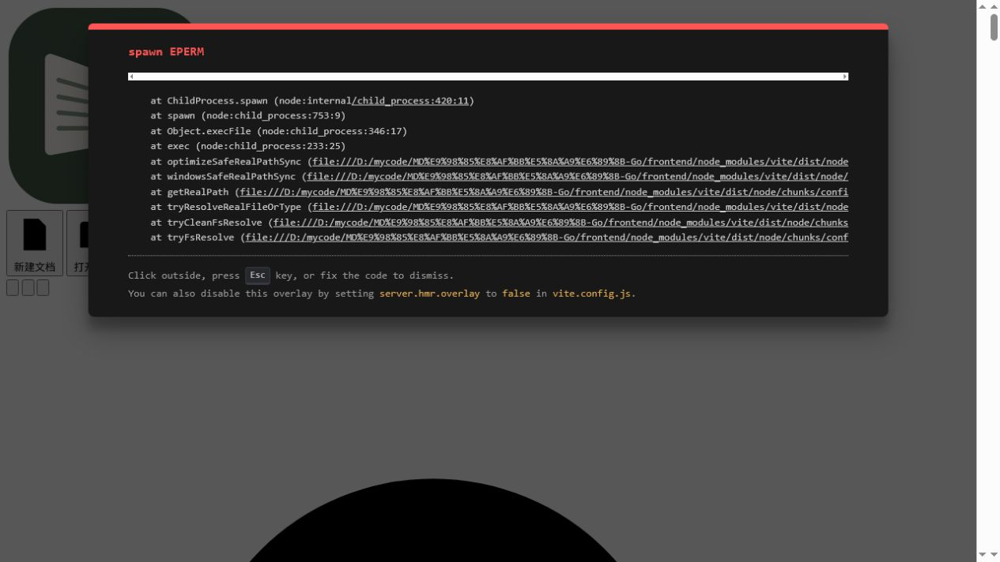
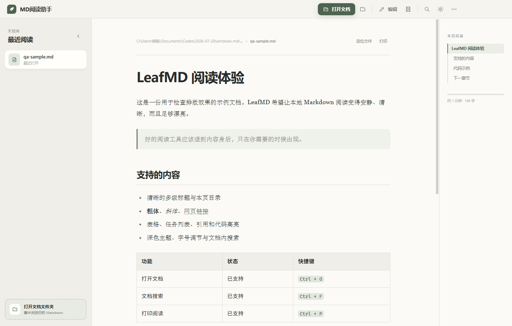

<div align="center">
  
  <h1>MD阅读助手</h1>
  <p><strong>快速、本地优先的 Markdown 阅读器、查看器和编辑器——Windows 安装包仅约 7 MB。</strong></p>
  <p>实时预览 · 语法高亮 · 本地文件 · Windows、macOS、Linux</p>
  <p><a href="README.md">English</a> · <strong>简体中文</strong></p>
  <p>
    <a href="https://github.com/liuhang798/md-reader-assistant/actions/workflows/release.yml"></a>
    <a href="https://github.com/liuhang798/md-reader-assistant/releases/latest"></a>
    <a href="LICENSE"></a>
    
  </p>
  <p>
    <a href="https://liuhang798.github.io/"><strong>访问官网</strong></a>
    ·
    <a href="https://github.com/liuhang798/md-reader-assistant/releases/latest"><strong>下载最新版本</strong></a>
    · <a href="#项目截图">查看截图</a>
    · <a href="#本地开发">从源码构建</a>
  </p>
</div>



## 为什么选择 MD阅读助手？

- **真正轻量：**使用 Go + Wails 构建，不依赖 Electron，Windows 安装包仅约 **7 MB**。
- **本地优先：**直接读取和保存电脑中的普通 Markdown 文件，无需账号、专用仓库或云端绑定。
- **阅读编辑一体：**既有专注的 Markdown 阅读模式，也有左侧实时预览、右侧语法高亮的分栏编辑模式。
- **完整桌面体验：**最近阅读、资源浏览器、自动保存、原生文件窗口、文件关联和更新提醒一应俱全。
- **跨平台开源：**采用 MIT 许可证，同时支持 Windows、macOS 和 Linux。

适合阅读长篇 Markdown 文档、编辑 README、维护技术笔记，以及集中管理本地文档文件夹。

## 下载

| 平台 | 安装包 | 下载 |
|---|---|---|
| Windows x64 | 分步安装程序（`.exe`） | [下载最新版本](https://github.com/liuhang798/md-reader-assistant/releases/latest) |
| macOS | Intel + Apple Silicon 通用版（`.dmg`） | [下载最新版本](https://github.com/liuhang798/md-reader-assistant/releases/latest) |
| Linux x64 | Debian 安装包 + 便携 AppImage | [下载最新版本](https://github.com/liuhang798/md-reader-assistant/releases/latest) |

Windows 用户运行 `md-reader-assistant-版本-windows-amd64.exe`，按安装向导操作即可；安装程序支持创建桌面快捷方式、Markdown 文件关联、升级时沿用上次安装目录，并在安装完成后直接启动软件。

macOS 版本使用系统原生左侧窗口控制按钮与应用菜单，并支持标准 Command 快捷键。

## 2.2.4 更新亮点

- 编辑状态下按 `Ctrl/Cmd + F` 可直接查找 Markdown 源码，高亮匹配内容并滚动定位，不再跳回预览页面。
- 查找替换面板会跟随简体中文或 English 界面语言，并采用与软件一致的精致工具栏样式。
- 左侧文档库和右侧本页目录支持拖动调整宽度，下次启动自动恢复布局。
- 资源浏览器会记住已选择的文件夹及当前侧栏视图，重新启动后继续显示。
- 再次点击已激活的“资源浏览器”标签，可随时重新选择文件夹。

## 主要功能

- 美观舒适的 Markdown 阅读与编辑界面。
- 左侧实时预览、右侧 Markdown 语法高亮编辑。
- 编辑工具栏支持标题、引用、加粗、斜体、链接、有序/无序列表、任务列表、表格、图片、行内代码和代码块；同时支持 `Ctrl/Cmd + B`、`Ctrl/Cmd + I`、`Ctrl/Cmd + K`。
- 支持工具栏或 `Ctrl/Cmd + Z` 连续撤回；不同文档的撤回历史相互隔离，无法撤销掉刚打开时的原始内容。
- 编辑状态下使用 `Ctrl/Cmd + F` 会直接查找 Markdown 源码，高亮匹配项并滚动定位；查找替换面板支持中英文界面并与整体视觉风格保持一致。
- 支持新建 Markdown 文件并立即编辑，编辑期间每 10 秒自动保存。
- 点击目录定位章节、当前章节跟随、文档搜索、打印和回到顶部。
- 左侧文档库和右侧本页目录支持拖动分隔条调整宽度，并在下次启动时恢复上次布局。
- 资源浏览器自动记忆已选文件夹和当前视图，下次启动继续显示；再次点击已激活的“资源浏览器”可更换文件夹。
- 打开文档后立即进入最近阅读，并可单独删除阅读记录。
- 简体中文和 English 界面切换，并自动记忆语言选择。
- 明暗主题和阅读字号调节。
- 左侧可在“最近阅读”和“资源浏览器”间切换，支持打开文件夹、刷新文件列表并集中浏览 Markdown。
- 原生打开/保存窗口，关联 `.md`、`.markdown`、`.mdown`、`.mkd` 文件。
- 单实例打开文件和未保存修改保护。
- 全新分栏阅读/编辑品牌图标，采用透明圆角边缘、无白色方底；“关于”页面包含作者邮箱和可直达的开源仓库。
- 启动时自动检查 GitHub Releases；发现新版本后可查看更新说明、直接打开下载页面，或选择 30 天内不再自动提醒；设置菜单仍支持手动检查。

## 项目截图

| 首页 | 阅读界面 |
|---|---|
|  |  |


## Go + Wails 2.0

2.0 版本开始使用 Go 和 Wails 替换 Electron，同时保留现有 HTML/CSS 界面和 CodeMirror 编辑器。当前 Windows 安装包约为 **7 MB**，原 Electron 安装包约为 90 MB。

- 后端：Go 1.23+
- 桌面框架：Wails 2.13
- 前端：HTML、CSS、JavaScript、Vite
- Markdown：marked、DOMPurify、highlight.js
- 编辑器：CodeMirror 6
- Windows 安装：NSIS

## 项目结构

- `main.go`：Wails 应用启动与窗口配置。
- `app.go`：文档、文件夹、最近阅读、偏好设置及桌面系统能力。
- `updates.go`：GitHub Releases 更新检查与版本比较。
- `frontend/`：Markdown 阅读器、CodeMirror 编辑器和双语界面。
- `build/`：应用图标及各平台构建配置。
- `packaging/`：Linux 桌面集成与软件包元数据。
- `scripts/`：可重复执行的项目资源维护脚本。

新建 Markdown 文档时无需选择保存目录，软件会优先保存到安装目录；若安装目录不可写，则自动保存到 `文档/MD Reader Assistant`。新建文档另存后会自动删除临时草稿及重复的最近阅读记录。绝对路径和相对路径引用的本地图片均由 Go 后端安全读取，可在预览区正常显示。

## 多平台版本

发布版本标签后，GitHub Actions 会自动生成：

- Windows x64：分步安装的 NSIS 安装程序
- macOS Universal：同时支持 Intel 和 Apple Silicon 的 DMG
- Linux x64：DEB 和 AppImage

当前开发版本尚未配置付费代码签名证书，因此 Windows 可能出现 SmartScreen 提醒，macOS 可能出现 Gatekeeper 提醒。

## 本地开发

需要安装 Go 1.23+、Node.js 22+、Wails 2.13，以及 Wails 对应平台的系统依赖。

```bash
go install github.com/wailsapp/wails/v2/cmd/wails@v2.13.0
wails dev
```

运行测试：

```bash
go test ./...
cd frontend
npm install
npm run build
```

生成 Windows 安装包：

```bash
wails build -clean -platform windows/amd64 -nsis -installscope user -webview2 embed -trimpath
```

推送 `v2.2.4` 等版本标签后，`.github/workflows/release.yml` 会自动构建三个系统的安装包并发布到 GitHub Releases。客户端会根据仓库的最新稳定 Release 提醒更新。

## 项目文档

- [项目官网](https://liuhang798.github.io/)
- [官网源代码](https://github.com/liuhang798/liuhang798.github.io)
- [更新记录](CHANGELOG.md)
- [AI 项目技术指南](AGENTS.md)
- [贡献指南](CONTRIBUTING.md)
- [安全策略](SECURITY.md)
- [发布指南](RELEASING.md)
- [设计验收记录](design-qa.md)

## 开源协议

[MIT](LICENSE)
