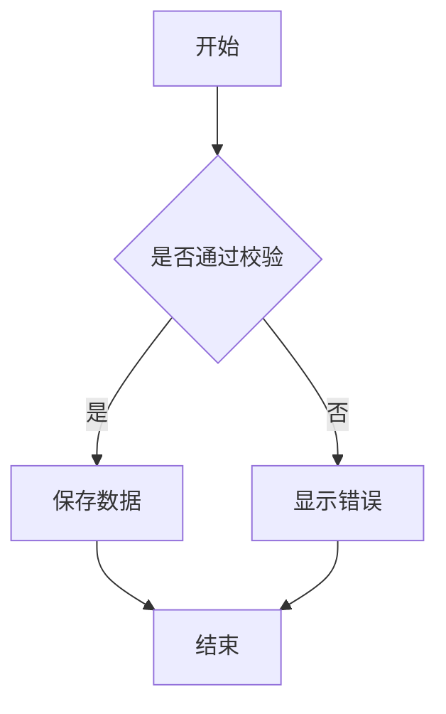
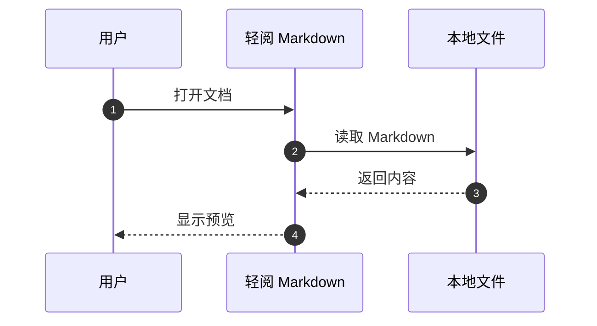
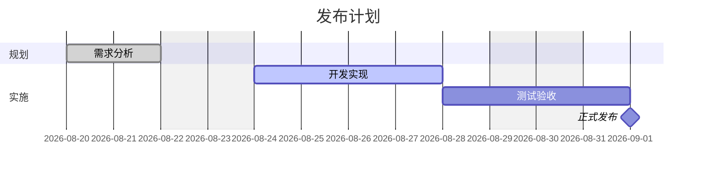

# Mermaid 图表使用示例

> 更完整的分类、功能说明与 22 类可复制案例，请查看 [Mermaid 图表完整案例](Mermaid-图表完整案例.md)。

轻阅 Markdown 支持 Typora 风格的 Mermaid 围栏代码块。把语言写成 `mermaid`，源码会在阅读页和编辑实时预览中自动转换成图表。

也可以在编辑器的“更多格式”中直接选择“Mermaid 流程图”“Mermaid 时序图”或“Mermaid 甘特图”，再修改生成的模板。

## 一、流程图

方向可以使用 `TD`（从上到下）或 `LR`（从左到右）。

## 二、时序图

## 三、甘特图

## 四、注意事项

- Mermaid 源码仍保存在 Markdown 文件中，软件不会把图表替换成图片。
- 图表语法错误时，只会在对应位置显示错误说明，不影响文档其他内容。
- Word 与独立 HTML 导出会把图表转换成清晰的内嵌图片；PDF 使用系统打印引擎，效果与预览一致。
- 为了安全，图表使用 Mermaid 严格模式，不执行节点中的脚本或点击事件。
