# Mermaid 图表完整案例

轻阅 Markdown 内置 Mermaid 11 图表引擎。只要把图表源码放进语言标记为 `mermaid` 的围栏代码块，阅读页面和编辑页面左侧的实时预览就会自动显示图表。

编辑器“更多格式”提供统一的“图表生成器”：弹窗内按用途列出本文覆盖的 22 类常用图表，选择后可以查看说明、编辑完整源码并实时预览，再一键插入 Markdown。所有源码仍保存在 Markdown 文件中，不会被替换成图片。

## 快速开始

基本写法如下。第一行决定图表类型，其余内容描述节点、关系或数据。

````markdown

````

## 一、流程图（Flowchart）

**适用场景：** 业务流程、审批逻辑、程序执行路径和决策分支。

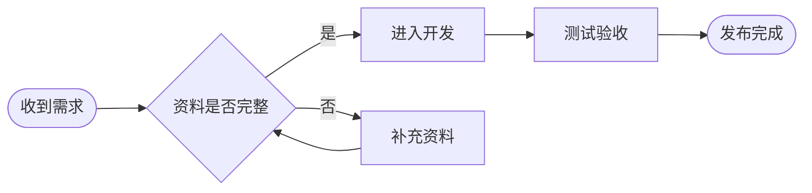

- `LR` 表示从左向右；可改成 `TD`，让图表从上向下排列。
- `[]` 是普通步骤，`{}` 是判断节点，`([])` 是起止节点。

## 二、时序图（Sequence Diagram）

**适用场景：** 接口调用、登录过程、客户端与服务器之间的交互顺序。

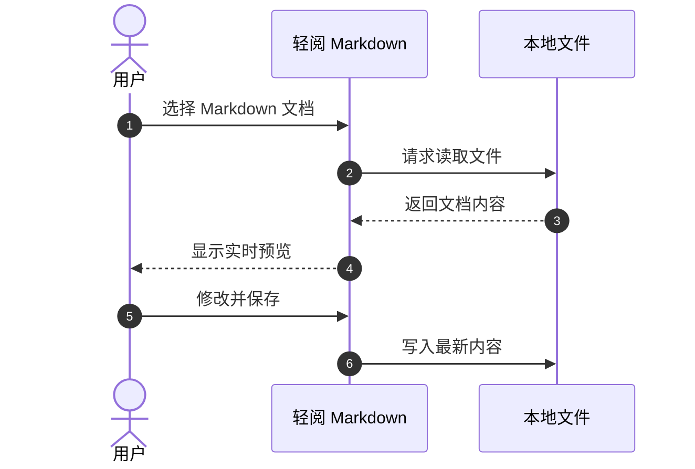

- `->>` 表示请求，`-->>` 常用于返回结果。
- `autonumber` 会自动给每一步编号。

## 三、甘特图（Gantt Chart）

**适用场景：** 项目排期、研发计划、任务依赖和里程碑管理。

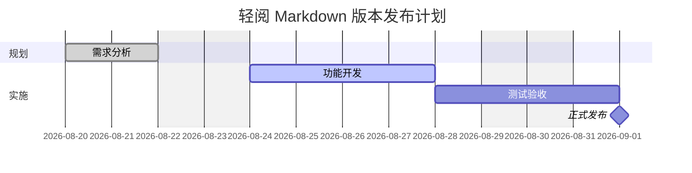

- `done`、`active` 分别表示已完成和进行中的任务。
- `after plan` 表示任务在 `plan` 完成后开始。

## 四、类图（Class Diagram）

**适用场景：** 面向对象设计、类属性、方法和类之间的关系。

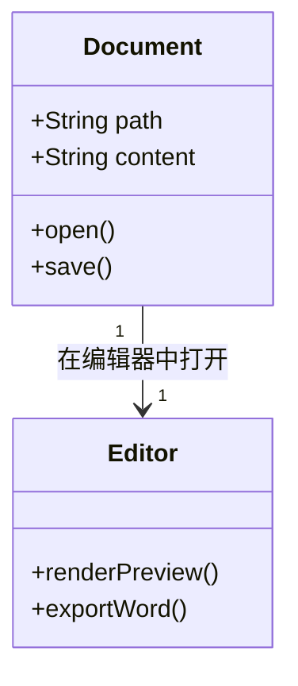

## 五、状态图（State Diagram）

**适用场景：** 订单状态、页面状态、文档生命周期和状态机设计。

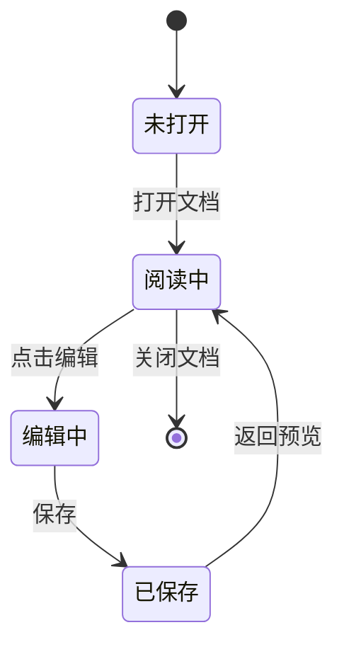

## 六、实体关系图（ER Diagram）

**适用场景：** 数据库表结构、实体字段及一对一、一对多关系。

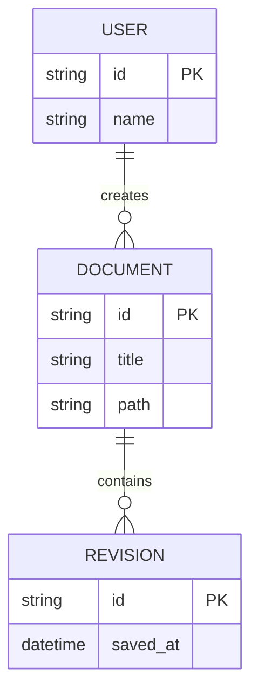

## 七、用户旅程图（User Journey）

**适用场景：** 用户体验分析、服务流程和各步骤满意度记录。

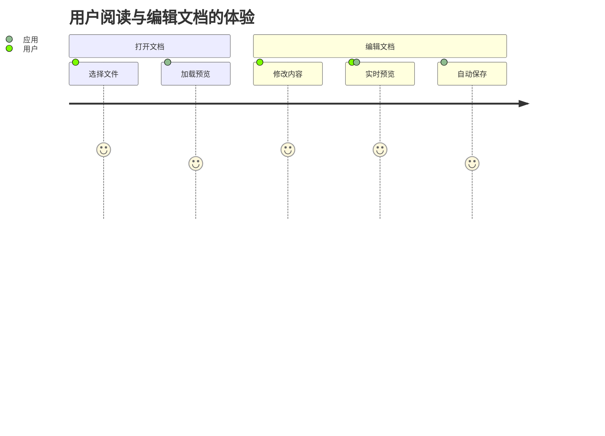

评分范围通常为 1～5，数字越高代表体验越好。

## 八、饼图（Pie Chart）

**适用场景：** 展示分类占比和构成比例。

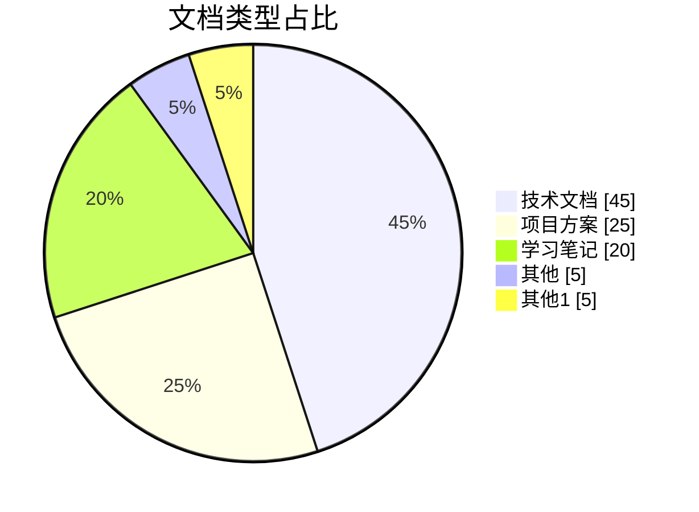

## 九、象限图（Quadrant Chart）

**适用场景：** 任务优先级、产品定位和二维指标分析。

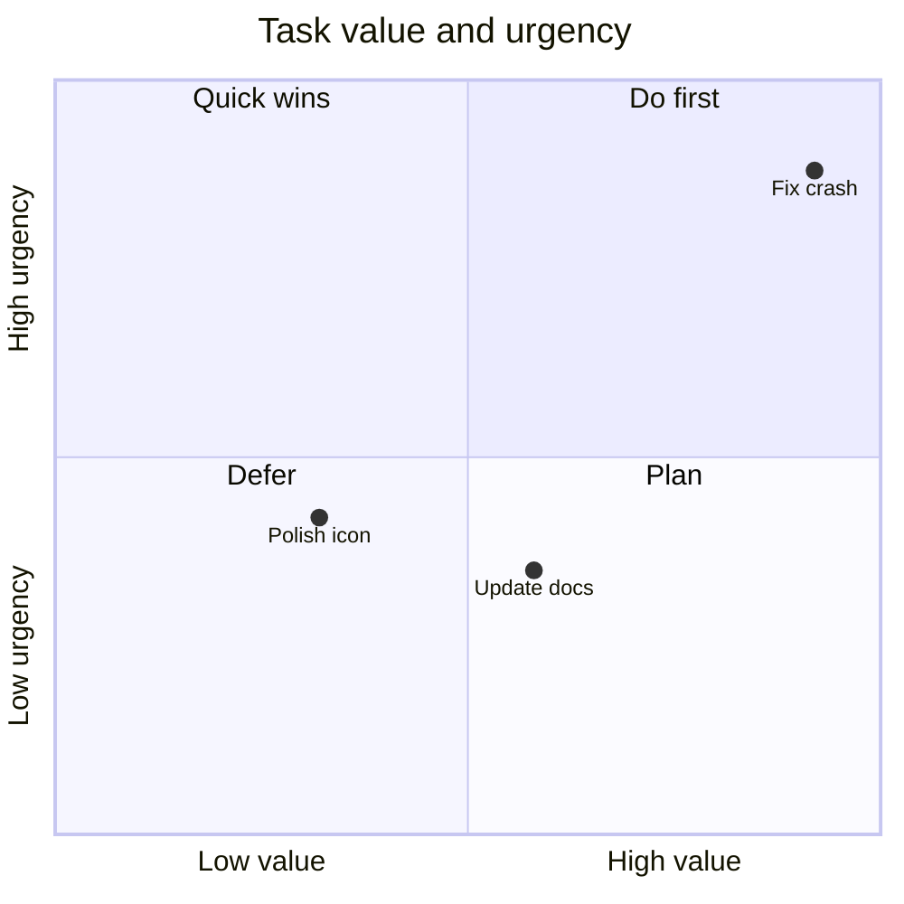

## 十、XY 图表（XY Chart）

**适用场景：** 趋势折线、数量柱状图和两组数据对比。

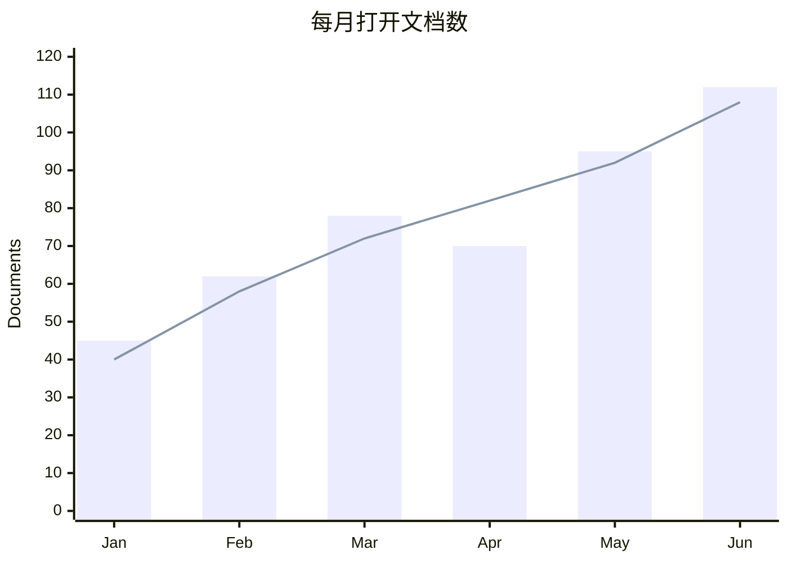

## 十一、需求图（Requirement Diagram）

**适用场景：** 软件需求、验证方法和需求与组件的追踪关系。

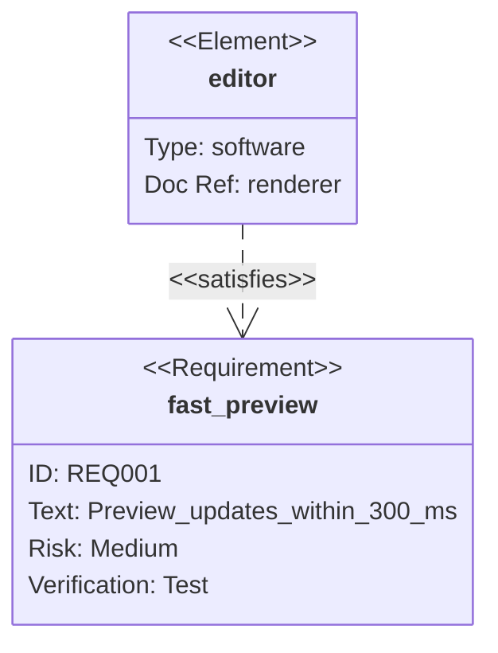

## 十二、Git 分支图（Git Graph）

**适用场景：** 版本分支、提交记录和合并过程说明。

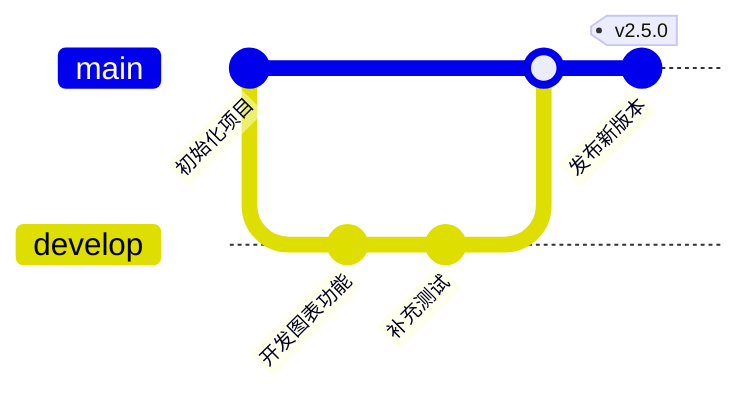

## 十三、思维导图（Mindmap）

**适用场景：** 知识整理、功能拆解、头脑风暴和文章大纲。

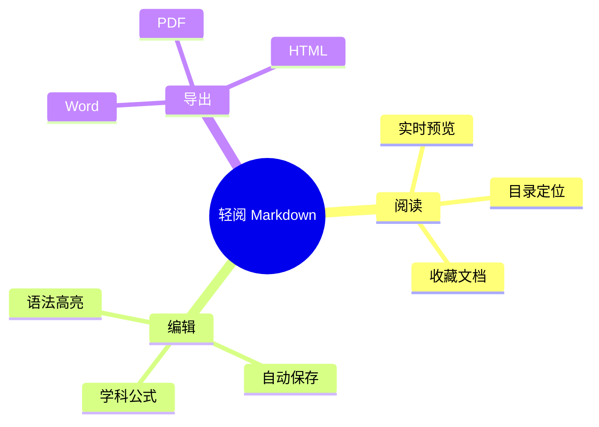

## 十四、时间线（Timeline）

**适用场景：** 产品发展、事件历史和阶段性成果展示。

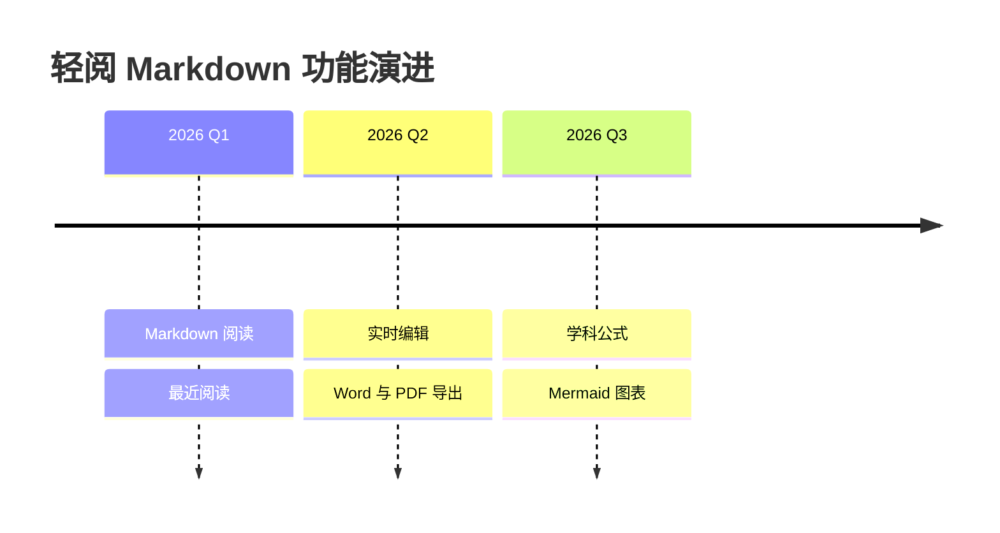

## 十五、看板（Kanban）

**适用场景：** 待办、进行中、测试中和已完成任务的可视化管理。


## 十六、桑基图（Sankey Diagram）

**适用场景：** 流量、能量、资金或数据在各环节中的去向与占比。

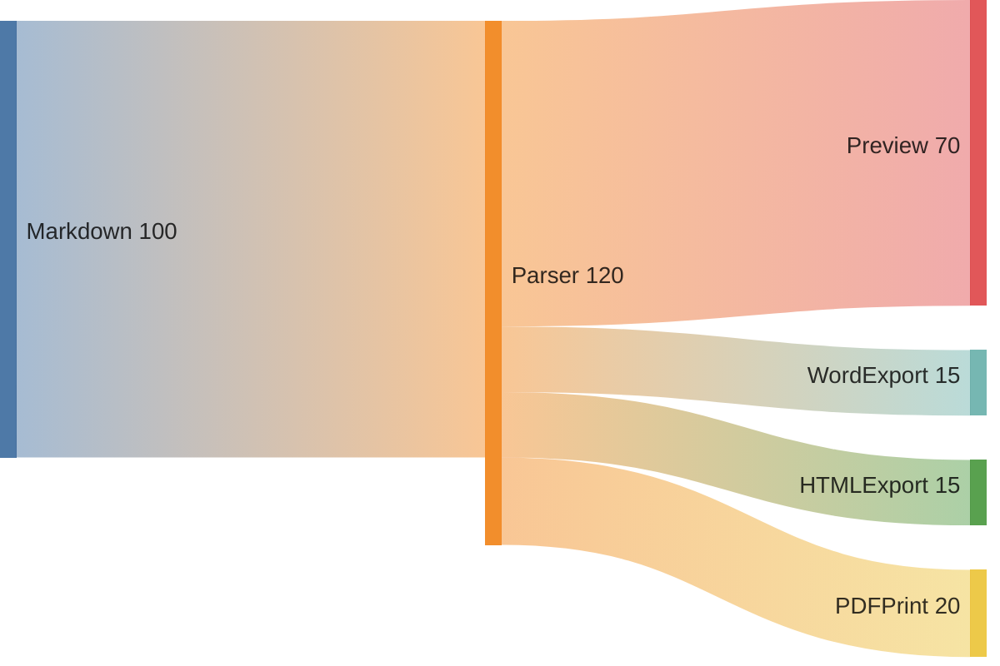

## 十七、块图（Block Diagram）

**适用场景：** 系统模块、硬件模块和数据处理管线。


## 十八、数据包图（Packet Diagram）

**适用场景：** 网络协议、二进制数据和字段位宽布局。

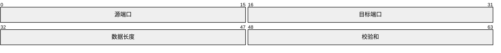

## 十九、架构图（Architecture Diagram）

**适用场景：** 系统服务、模块分组、存储与模块连接关系。

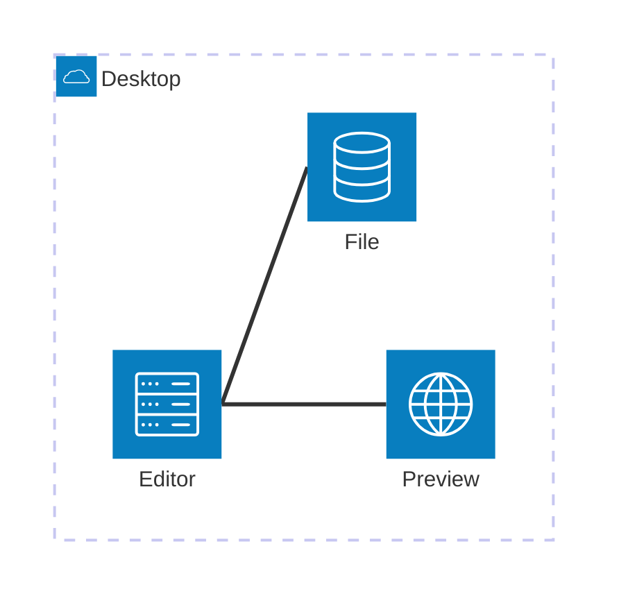

## 二十、雷达图（Radar Diagram）

**适用场景：** 多维能力评估和同一对象多个指标的综合对比。

```mermaid
radar-beta
    title 轻阅 Markdown 能力分布
    axis speed["速度"], preview["预览"], export["导出"], theme["主题"], local["本地"]
    curve quillite["轻阅"]{95, 90, 82, 88, 100}
    max 100
    min 0
```

## 二十一、树状矩形图（Treemap）

**适用场景：** 用面积大小展示层级数据及各部分占比。

```mermaid
treemap-beta
    "轻阅 Markdown"
        "阅读": 35
        "编辑": 30
        "导出": 20
        "图表": 15
```

## 二十二、C4 系统上下文图（C4 Context）

**适用场景：** 从用户与外部系统视角说明软件边界和主要依赖。

```mermaid
C4Context
    title 轻阅 Markdown 系统上下文
    Person(user, "用户", "阅读和编辑本地 Markdown 文档")
    System(app, "轻阅 Markdown", "跨平台 Markdown 阅读编辑器")
    System_Ext(site, "官方网站", "提供教程、版本与下载")
    Rel(user, app, "打开、阅读和编辑")
    Rel(app, site, "检查更新", "HTTPS")
```

## 使用与导出说明

- 在编辑器中输入或粘贴 `mermaid` 代码块，左侧预览会自动刷新。
- 图表会跟随软件的明暗模式和主题色，窗口变窄时可在图表区域内滚动查看。
- 图表语法错误时，只会在对应位置显示错误说明，不影响文档其他部分。
- Word 与独立 HTML 导出会把图表转换为清晰的内嵌图片；PDF 使用系统打印引擎，尽量保持预览中的排版。
- 软件使用 Mermaid 严格安全模式，不执行节点内的脚本或点击事件。
- 22 类常用图表都可以从“更多格式 → 图表生成器”选择、编辑、预览并一键插入。
